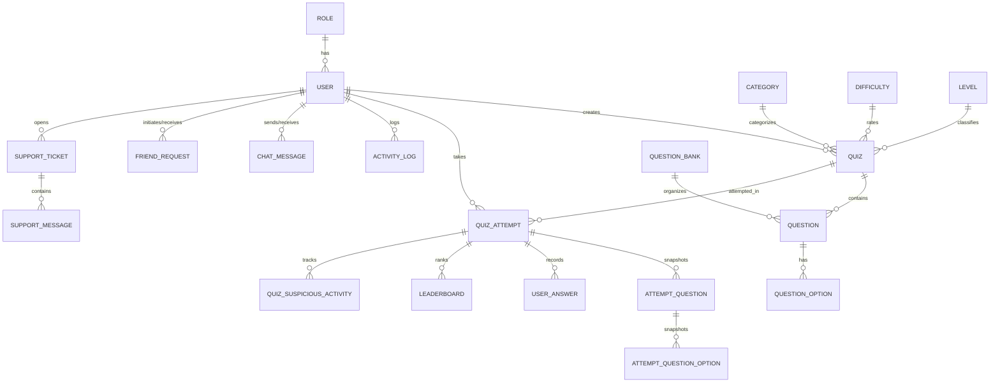

# 🎓 QuizPlatform API

[](https://dotnet.microsoft.com/)
[](https://learn.microsoft.com/en-us/aspnet/web-api/)
[](https://learn.microsoft.com/en-us/ef/ef6/)
[](https://www.microsoft.com/en-us/sql-server)
[](https://jwt.io/)

**QuizPlatform API** adalah backend RESTful API berbasis **ASP.NET Web API 2 (.NET Framework 4.8)** dan **Entity Framework 6** yang dirancang untuk platform ujian, kuis online, manajemen bank soal, pemantauan kecurangan (*anti-cheat*), analisis performa siswa, fitur sosial (pertemanan & chat), serta sistem tiket bantuan (*support desk*).

---

## 📌 Daftar Isi
- [Fitur Utama](#-fitur-utama)
- [Arsitektur & Teknologi](#-arsitektur--teknologi)
- [Struktur Direktori](#-struktur-direktori)
- [Model Data & Relasi Entity](#-model-data--relasi-entity)
- [Daftar Endpoint API](#-daftar-endpoint-api)
- [Panduan Instalasi & Menjalankan](#-panduan-instalasi--menjalankan)
- [Konfigurasi Web.config](#-konfigurasi-webconfig)
- [Peran Pengguna (Role-Based Access Control)](#-peran-pengguna-role-based-access-control)
- [Lisensi & Kontribusi](#-lisensi--kontribusi)

---

## 🚀 Fitur Utama

### 🔐 1. Otentikasi & Keamanan (Authentication & Security)
- **JWT (JSON Web Token) Bearer Authentication** untuk otentikasi stateless yang aman.
- **Registrasi Siswa dengan Verifikasi Email OTP** via SMTP Gmail.
- **Lupa Password & Reset Password** menggunakan kode OTP email.
- **Ganti Password dengan Kode Konfirmasi Email**.
- **Audit Trail & Activity Logging** untuk melacak setiap aksi penting di sistem (login, buat kuis, ubah profile, dll).

### 📝 2. Manajemen Kuis & Bank Soal (Quiz & Question Bank)
- **Manajemen Kuis Lengkap**: CRUD Kuis, filter berdasarkan kategori dan tingkat kesulitan.
- **Validasi Publish Kuis**: Memeriksa kelengkapan soal dan opsi sebelum kuis dipublish.
- **Dukungan Berbagai Tipe Soal**: Pilihan Ganda (*Multiple Choice*) dan Esai (*Essay*).
- **Upload Gambar Soal**: Mendukung lampiran gambar pada soal kuis.
- **Bank Soal (Question Bank)**: Simpan koleksi soal master untuk digunakan kembali.
- **Salin Soal / Acak Soal dari Bank Soal**: Kemampuan mengambil sejumlah soal secara acak dari bank soal ke kuis target.
- **Import Soal Excel**: Memasukkan bank soal dalam jumlah banyak secara massal melalui template Excel.

### 🛡️ 3. Pengerjaan Kuis & Anti-Cheat Engine
- **Session Attempt Kuis**: Soal dan opsi jawaban di-snapshot dan diacak per attempt siswa.
- **Pencatatan Aktivitas Mencurigakan (Anti-Cheat)**: Mendeteksi aksi seperti pindah tab (*tab switch/blur*), keluar layar penuh (*fullscreen exit*), atau kombinasi tombol mencurigakan.
- **Perhitungan Nilai Otomatis & Penilaian Manual Esai**: Soal pilihan ganda dinilai otomatis, sementara esai disediakan antarmuka penilaian bagi Pengajar/Admin.
- **Riwayat Kuis & Rincian Hasil**: Siswa dapat melihat skor, kunci jawaban, dan pembahasan detail.

### 📊 4. Analisis, Laporan & Leaderboard
- **Statistik Dashboard Admin & Guru**: Total kuis, total siswa, rata-rata nilai, kuis aktif.
- **Analisis Kinerja Soal (*Question Analytics*)**: Mengetahui soal mana yang paling sering dijawab salah/benar.
- **Top Students Leaderboard**: Peringkat siswa berprestasi per kuis maupun global.
- **Pembaruan Ranking Real-time / Scheduled**.

### 💬 5. Fitur Sosial, Chat & Notifikasi
- **Sistem Pertemanan**: Cari pengguna, kirim/terima/tolak permintaan pertemanan, dan daftar teman.
- **Percakapan 1-on-1 (Direct Chat)**: Riwayat percakapan antar teman.
- **Pusat Notifikasi Siswa**: Notifikasi pengumuman kuis baru, perubahan nilai, dll. (mendukung baca satuan dan *mark all as read*).

### 🎫 6. Helpdesk & Tiket Dukungan (Support Tickets)
- Siswa dapat membuat tiket laporan kendala/bantuan.
- Admin dapat membalas tiket percakapan langsung (*support thread*) dan menutup tiket setelah selesai.

---

## 🛠️ Arsitektur & Teknologi

| Komponen | Teknologi / Library |
|---|---|
| **Framework** | .NET Framework 4.8 / ASP.NET Web API 2 / ASP.NET MVC 5 |
| **ORM / Data Access** | Entity Framework 6.5.2 (Code First / DbContext) |
| **Database** | Microsoft SQL Server (didukung juga Npgsql untuk PostgreSQL) |
| **Authentication** | Microsoft.Owin.Security.Jwt, System.IdentityModel.Tokens.Jwt |
| **Email Service** | System.Net.Mail (SMTP Gmail TLS/SSL) |
| **Serialization** | Newtonsoft.Json 13.0.3, System.Text.Json |
| **Cross-Origin** | Microsoft.AspNet.WebApi.Cors (CORS Enabled) |

---

## 📁 Struktur Direktori

```text
QuizPlatform/
│
├── QuizPlatform.sln                   # Visual Studio Solution
├── packages/                          # NuGet Packages cache
│
└── QuizPlatform.API/                  # Proyek Utama Web API
    ├── App_Start/                     # Konfigurasi aplikasi
    │   ├── BundleConfig.cs
    │   ├── FilterConfig.cs
    │   ├── RouteConfig.cs
    │   └── WebApiConfig.cs            # Konfigurasi routing API & CORS
    │
    ├── Controllers/                   # Controller API & MVC
    │   ├── AdminApiController.cs
    │   ├── AntiCheatApiController.cs
    │   ├── AuthApiController.cs
    │   ├── CategoryApiController.cs
    │   ├── ChatApiController.cs
    │   ├── DashboardApiController.cs
    │   ├── DifficultyApiController.cs
    │   ├── EssayGradingApiController.cs
    │   ├── FriendApiController.cs
    │   ├── LeaderboardApiController.cs
    │   ├── LevelApiController.cs
    │   ├── NotificationApiController.cs
    │   ├── QuestionApiController.cs
    │   ├── QuestionBankApiController.cs
    │   ├── QuestionOptionApiController.cs
    │   ├── QuizApiController.cs
    │   ├── QuizAttemptApiController.cs
    │   ├── RoleApiController.cs
    │   ├── StudentApiController.cs
    │   ├── SupportController.cs
    │   ├── TeacherApiController.cs
    │   ├── UserAnswerApiController.cs
    │   └── UserApiController.cs
    │
    ├── Helpers/                       # Utility & Auth helper
    │   ├── AuthHelper.cs
    │   ├── JwtHelper.cs               # Pembuat token JWT & konfigurasi secret
    │   └── RoleConstant.cs            # Konstanta Role (Admin, Teacher, Student)
    │
    ├── Models/
    │   ├── Dtos/                      # Data Transfer Objects (Request/Response)
    │   ├── Entity/                    # Entity Framework Data Models
    │   │   ├── ActivityLog.cs
    │   │   ├── AttemptQuestion.cs
    │   │   ├── AttemptQuestionOption.cs
    │   │   ├── Category.cs
    │   │   ├── ChatMessage.cs
    │   │   ├── Difficulty.cs
    │   │   ├── EmailOtp.cs
    │   │   ├── FriendRequest.cs
    │   │   ├── Leaderboard.cs
    │   │   ├── Level.cs
    │   │   ├── Question.cs
    │   │   ├── QuestionBank.cs
    │   │   ├── QuestionOption.cs
    │   │   ├── Quiz.cs
    │   │   ├── QuizAttempt.cs
    │   │   ├── QuizSuspiciousActivity.cs
    │   │   ├── Role.cs
    │   │   ├── StudentNotification.cs
    │   │   ├── SupportMessage.cs
    │   │   ├── SupportTicket.cs
    │   │   ├── User.cs
    │   │   └── UserAnswer.cs
    │   └── Generator/                 # Password generator helper
    │
    ├── Services/
    │   ├── Context/
    │   │   └── QuizDbContext.cs       # Entity Framework DbContext
    │   ├── Interface/                 # Kontrak Service (Interface)
    │   └── Impl/                      # Implementasi Service / Business Logic
    │
    ├── Uploads/                       # Folder penyimpanan gambar upload
    │   ├── Profile/
    │   └── Questions/
    │
    ├── Startup.cs                     # OWIN Startup (JWT Bearer middleware)
    ├── Web.config                     # Konfigurasi DB, SMTP, dan runtime
    └── packages.config                # Daftar dependency NuGet
```

---

## 🗄️ Model Data & Relasi Entity



---

## 📡 Daftar Endpoint API

Semua endpoint dengan tanda 🔒 **[Auth]** memerlukan header:
```http
Authorization: Bearer <JWT_TOKEN>
```

### 1. Autentikasi (`/api/Auth`)
| Method | Endpoint | Deskripsi | Akses |
|---|---|---|---|
| `POST` | `/api/auth/login` | Login user & dapatkan JWT Token | Publik |
| `POST` | `/api/Auth/RegisterStudent` | Registrasi siswa baru & kirim OTP email | Publik |
| `POST` | `/api/Auth/VerifyRegisterCode` | Verifikasi kode OTP registrasi | Publik |
| `POST` | `/api/Auth/ForgotPassword` | Minta kode reset password ke email | Publik |
| `POST` | `/api/Auth/ResetPassword` | Reset password dengan kode OTP | Publik |
| `POST` | `/api/Auth/RequestChangePasswordCode` | Minta OTP ganti password | 🔒 Logged in |
| `POST` | `/api/Auth/ChangePasswordWithCode` | Ganti password dengan OTP | 🔒 Logged in |

### 2. Profil & Akun Pengguna (`/api/Profile`, `/api/User`)
| Method | Endpoint | Deskripsi | Akses |
|---|---|---|---|
| `GET` | `/api/Profile` | Ambil data profil & statistik siswa login | 🔒 Logged in |
| `PUT` | `/api/Profile/Update` | Perbarui data profil (nama, bio, dll.) | 🔒 Logged in |
| `PUT` | `/api/Profile/ChangePassword` | Ubah password dari akun login | 🔒 Logged in |
| `PUT` | `/api/Profile/Image` | Update URL foto profil | 🔒 Logged in |
| `POST` | `/api/Profile/UploadImage` | Upload file fisik foto profil | 🔒 Logged in |
| `GET` | `/api/User/GetAllUsers` | Mengambil seluruh user | 🔒 Admin |
| `POST` | `/api/User/CreateUser` | Menambahkan user baru secara manual | 🔒 Admin |

### 3. Manajemen Kuis (`/api/Quiz`)
| Method | Endpoint | Deskripsi | Akses |
|---|---|---|---|
| `GET` | `/api/Quiz/GetAll` | Daftar semua kuis yang tersedia | 🔒 Logged in |
| `GET` | `/api/Quiz/GetById/{quizId}` | Detail spesifik sebuah kuis | 🔒 Logged in |
| `GET` | `/api/Quiz/Filter?categoryId=&difficultyId=` | Filter kuis berdasarkan kriteria | 🔒 Logged in |
| `GET` | `/api/Quiz/MyQuizzes` | Daftar kuis milik guru/admin login | 🔒 Teacher/Admin |
| `POST` | `/api/Quiz/Create` | Buat kuis baru | 🔒 Teacher/Admin |
| `PUT` | `/api/Quiz/Update` | Perbarui info kuis | 🔒 Teacher/Admin |
| `DELETE` | `/api/Quiz/Delete/{quizId}` | Hapus kuis | 🔒 Teacher/Admin |
| `GET` | `/api/Quiz/ValidatePublish/{quizId}` | Cek validasi sebelum publish kuis | 🔒 Teacher/Admin |
| `POST` | `/api/Quiz/Publish/{quizId}` | Publikasikan kuis agar bisa diakses siswa | 🔒 Teacher/Admin |
| `POST` | `/api/Quiz/Unpublish/{quizId}` | Tarik kuis dari publikasi | 🔒 Teacher/Admin |

### 4. Manajemen Soal & Bank Soal (`/api/Question`, `/api/QuestionBank`)
| Method | Endpoint | Deskripsi | Akses |
|---|---|---|---|
| `GET` | `/api/Question/ByQuiz/{quizId}` | Ambil daftar soal dalam suatu kuis | 🔒 Teacher/Admin |
| `POST` | `/api/Question/Create` | Buat soal baru pada kuis | 🔒 Teacher/Admin |
| `PUT` | `/api/Question/Update` | Perbarui data soal | 🔒 Teacher/Admin |
| `DELETE` | `/api/Question/Delete/{questionId}` | Hapus soal | 🔒 Teacher/Admin |
| `POST` | `/api/Question/UploadImage` | Upload gambar untuk soal | 🔒 Teacher/Admin |
| `POST` | `/api/Question/ImportExcel` | Import soal secara massal dari Excel | 🔒 Teacher/Admin |
| `GET` | `/api/QuestionBank/GetAll` | Daftar bank soal | 🔒 Teacher/Admin |
| `POST` | `/api/QuestionBank/Create` | Buat bank soal baru | 🔒 Teacher/Admin |
| `POST` | `/api/Question/CopyToQuiz/{questionId}/{quizId}` | Salin 1 soal dari bank ke kuis | 🔒 Teacher/Admin |
| `POST` | `/api/Question/CopyRandomFromBank` | Salin soal acak dari bank ke kuis | 🔒 Teacher/Admin |

### 5. Pengerjaan Ujian & Anti-Cheat (`/api/QuizAttempt`, `/api/AntiCheat`, `/api/UserAnswer`)
| Method | Endpoint | Deskripsi | Akses |
|---|---|---|---|
| `POST` | `/api/QuizAttempt/Start` | Mulai attempt kuis (generate soal acak) | 🔒 Student |
| `POST` | `/api/UserAnswer/Submit` | Simpan jawaban soal (pilihan ganda/esai) | 🔒 Student |
| `POST` | `/api/QuizAttempt/End` | Akhiri attempt kuis & hitung skor | 🔒 Student |
| `GET` | `/api/QuizAttempt/Result/{attemptId}` | Dapatkan detail hasil & pembahasan kuis | 🔒 Logged in |
| `GET` | `/api/QuizAttempt/History` | Riwayat kuis yang pernah dikerjakan | 🔒 Student |
| `POST` | `/api/AntiCheat/Log` | Kirim log indikasi kecurangan ujian | 🔒 Student |
| `GET` | `/api/AntiCheat/Logs` | Lihat seluruh riwayat log kecurangan | 🔒 Teacher/Admin |

### 6. Penilaian Esai (`/api/EssayGrading`)
| Method | Endpoint | Deskripsi | Akses |
|---|---|---|---|
| `GET` | `/api/EssayGrading/Pending` | Daftar jawaban esai yang menunggu dinilai | 🔒 Teacher/Admin |
| `PUT` | `/api/EssayGrading/Grade` | Berikan skor dan feedback pada jawaban esai | 🔒 Teacher/Admin |

### 7. Laporan & Analisis Guru (`/api/Teacher`, `/api/Dashboard`)
| Method | Endpoint | Deskripsi | Akses |
|---|---|---|---|
| `GET` | `/api/Teacher/DashboardStats` | Statistik ringkas pengajar | 🔒 Teacher/Admin |
| `GET` | `/api/Teacher/Analytics` | Analisis komprehensif performa kuis | 🔒 Teacher/Admin |
| `GET` | `/api/Teacher/QuestionAnalytics` | Analisis tingkat kesulitan dan akurasi soal | 🔒 Teacher/Admin |
| `GET` | `/api/Teacher/TopStudents` | Daftar peringkat siswa terbaik | 🔒 Teacher/Admin |
| `GET` | `/api/Dashboard/Stats` | Statistik agregat sistem keseluruhan | 🔒 Admin |

### 8. Peringkat & Leaderboard (`/api/Leaderboard`)
| Method | Endpoint | Deskripsi | Akses |
|---|---|---|---|
| `GET` | `/api/Leaderboard/Get/{quizId}` | Ambil papan peringkat kuis | 🔒 Logged in |
| `POST` | `/api/Leaderboard/Create` | Daftarkan hasil attempt ke leaderboard | 🔒 Student |
| `POST` | `/api/Leaderboard/UpdateRank/{quizId}` | Kalkulasi ulang peringkat leaderboard | 🔒 Admin |

### 9. Pertemanan & Chat (`/api/Friend`, `/api/Chat`)
| Method | Endpoint | Deskripsi | Akses |
|---|---|---|---|
| `GET` | `/api/Friend/SearchUsers?keyword=` | Cari pengguna lain berdasarkan nama/username | 🔒 Logged in |
| `POST` | `/api/Friend/Add/{receiverId}` | Kirim permintaan pertemanan | 🔒 Logged in |
| `GET` | `/api/Friend/Requests` | Daftar permintaan pertemanan masuk | 🔒 Logged in |
| `POST` | `/api/Friend/Accept/{requestId}` | Terima permintaan pertemanan | 🔒 Logged in |
| `POST` | `/api/Friend/Reject/{requestId}` | Tolak permintaan pertemanan | 🔒 Logged in |
| `GET` | `/api/Friend/MyFriends` | Ambil daftar teman saat ini | 🔒 Logged in |
| `GET` | `/api/Chat/Conversation/{friendId}` | Ambil riwayat chat dengan teman tertentu | 🔒 Logged in |
| `POST` | `/api/Chat/Send` | Kirim pesan chat | 🔒 Logged in |

### 10. Notifikasi (`/api/Notification`)
| Method | Endpoint | Deskripsi | Akses |
|---|---|---|---|
| `GET` | `/api/Notification/Summary` | Ringkasan notifikasi siswa | 🔒 Logged in |
| `GET` | `/api/Notification/Items` | Daftar notifikasi | 🔒 Logged in |
| `GET` | `/api/Notification/UnreadCount` | Jumlah notifikasi yang belum dibaca | 🔒 Logged in |
| `PUT` | `/api/Notification/Read/{id}` | Tandai notifikasi spesifik sebagai dibaca | 🔒 Logged in |
| `PUT` | `/api/Notification/ReadAll` | Tandai semua notifikasi sebagai dibaca | 🔒 Logged in |

### 11. Tiket Bantuan / Support (`/api/Support`)
| Method | Endpoint | Deskripsi | Akses |
|---|---|---|---|
| `POST` | `/api/Support/CreateTicket` | Buka tiket bantuan baru | 🔒 Logged in |
| `GET` | `/api/Support/MyTickets` | Lihat tiket bantuan milik sendiri | 🔒 Logged in |
| `GET` | `/api/Support/Admin/Tickets` | Lihat semua tiket bantuan yang masuk | 🔒 Admin |
| `GET` | `/api/Support/Messages/{ticketId}` | Ambil riwayat pesan dalam tiket | 🔒 Logged in |
| `POST` | `/api/Support/SendMessage` | Kirim pesan dalam tiket | 🔒 Logged in |
| `POST` | `/api/Support/Admin/Reply` | Admin membalas pesan tiket | 🔒 Admin |
| `PUT` | `/api/Support/Admin/CloseTicket/{ticketId}`| Menutup status tiket bantuan | 🔒 Admin |

### 12. Master Data / Lookup Data
- `GET /api/Category/GetAll` – Mengambil daftar kategori kuis.
- `GET /api/Difficulty/GetAll` – Mengambil daftar tingkat kesulitan (Easy, Medium, Hard).
- `GET /api/Level/GetAll` – Mengambil daftar jenjang/level kuis.
- `GET /api/Role/GetAll` – Mengambil daftar role pengguna.

---

## 💻 Panduan Instalasi & Menjalankan

### 📋 Prasyarat
1. **Windows OS** dengan [.NET Framework 4.8 Developer Pack](https://dotnet.microsoft.com/en-us/download/dotnet-framework/net48).
2. **Visual Studio 2019 / 2022** dengan *workload* **ASP.NET and web development**.
3. **Microsoft SQL Server** (Express / Developer / Standard) atau **PostgreSQL**.
4. **SQL Server Management Studio (SSMS)** atau tools database lainnya.

---

### ⚙️ Langkah-Langkah Menjalankan

1. **Clone Repositori**:
   ```bash
   git clone <URL_REPOSITORY_ANDA>
   cd QuizPlatform
   ```

2. **Restore NuGet Packages**:
   Buka `QuizPlatform.sln` di Visual Studio, klik kanan pada Solution Explorer, lalu pilih **Restore NuGet Packages** (atau gunakan package manager console):
   ```powershell
   Update-Package -reinstall
   ```

3. **Konfigurasi Database**:
   Buka file [Web.config](file:///d:/C%23/QuizPlatform/QuizPlatform.API/Web.config) di proyek `QuizPlatform.API` dan sesuaikan *Connection String* dengan server SQL Server lokal Anda:
   ```xml
   <connectionStrings>
     <add name="QuizDbContext" 
          connectionString="data source=YOUR_SERVER_NAME;initial catalog=QuizPlatformDB;Integrated Security=True;MultipleActiveResultSets=True;" 
          providerName="System.Data.SqlClient" />
   </connectionStrings>
   ```

4. **Inisialisasi Database**:
   Entity Framework Code-First akan membuat database secara otomatis saat aplikasi pertama kali dijalankan dan melakukan query terhadap `QuizDbContext`. Anda juga dapat menjalankan migrasi jika diperlukan.

5. **Jalankan Aplikasi**:
   - Tekan tombol **F5** atau **Ctrl + F5** di Visual Studio untuk menjalankan backend via **IIS Express**.
   - Endpoint dasar biasanya berjalan di: `http://localhost:<PORT>/` (contoh: `http://localhost:5000/api/...`).

---

## ⚙️ Konfigurasi Web.config

Beberapa konfigurasi penting yang terdapat pada `Web.config`:

```xml
<appSettings>
  <!-- Konfigurasi SMTP Email untuk OTP dan Notifikasi -->
  <add key="SmtpHost" value="smtp.gmail.com" />
  <add key="SmtpPort" value="587" />
  <add key="SmtpEmail" value="your_email@gmail.com" />
  <add key="SmtpPassword" value="your_app_password" />
  <add key="SmtpName" value="Quiz Platform" />
</appSettings>
```

> [!TIP]
> Untuk menggunakan SMTP Gmail, pastikan Anda menggunakan **App Password (Sandi Aplikasi)** dari pengaturan akun Google Anda, bukan password email biasa.

---

## 👥 Peran Pengguna (Role-Based Access Control)

| Role | Deskripsi & Hak Akses |
|---|---|
| 👑 **Admin** | Akses penuh ke seluruh fitur: manajemen user & role, rekap audit log, statistik global, manajemen tiket bantuan, dan pengelolaan kuis/soal. |
| 🧑‍🏫 **Teacher** | Membuat dan mengelola kuis, bank soal, mengoreksi jawaban esai, mengawasi log kecurangan ujian, serta mengakses laporan analitik performa kuis dan siswa. |
| 🎓 **Student** | Mengerjakan kuis yang dipublish, melihat riwayat dan pembahasan nilai, melihat papan peringkat, menambah teman, berkirim pesan, serta membuat tiket bantuan. |

---

## 📄 Lisensi & Kontribusi

Proyek ini dikembangkan untuk kebutuhan platform evaluasi pembelajaran online. Jika ingin berkontribusi:
1. Fork repository ini.
2. Buat branch fitur baru (`git checkout -b feature/FiturKeren`).
3. Commit perubahan (`git commit -m 'Menambahkan Fitur Keren'`).
4. Push ke branch (`git push origin feature/FiturKeren`).
5. Buat Pull Request.

---
*Dibuat dengan ❤️ menggunakan ASP.NET Web API & Entity Framework.*
